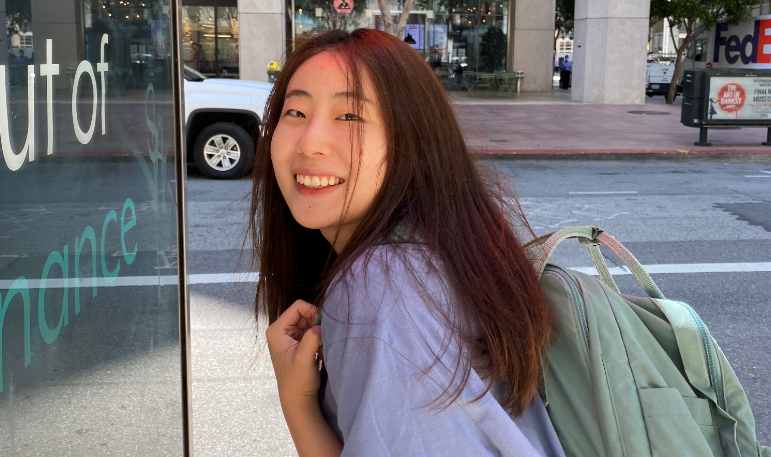

Hello! I'm a motivated junior Graphic Design student at Arizona State University, deeply passionate about bringing creative visions to life. My academic journey is also enriched by a foundational knowledge in web development and programming languages, skills that complement my design prowess and allow me to explore a wider canvas of digital creativity. Beyond the confines of technology and design, my inspiration comes from my daughter, Eusa, whose name metaphorically captures the essence of how we face life — 'Eu' for rain, symbolizing the difficulties and obstacles we encounter, and 'Sa' as a dance with the wind, representing the beautiful flight we embark on despite these challenges. This philosophy of resilience and beauty in adversity influences my work and approach to life. Driven by curiosity, I am dedicated to learning new technologies and exploring the world, always ready to adapt and grow. With each new day, I embrace the opportunity to infuse my projects with the creativity and resilience inspired by my daughter. I look forward to where this artistic and technological journey will lead me."
